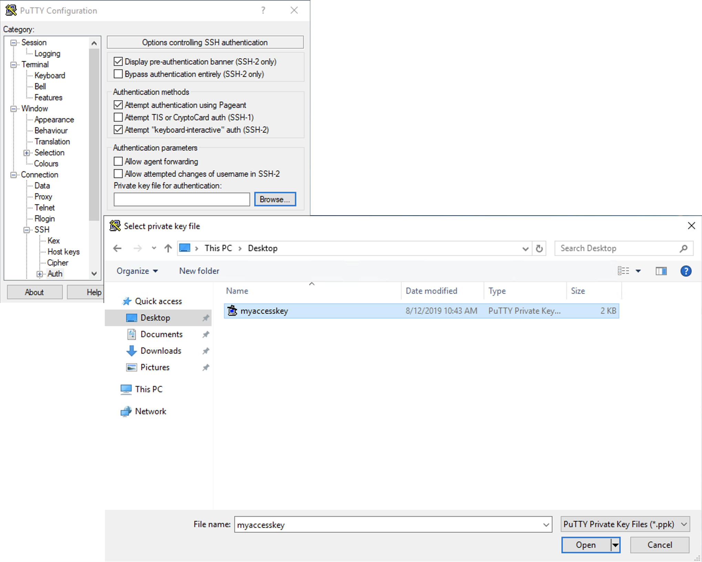
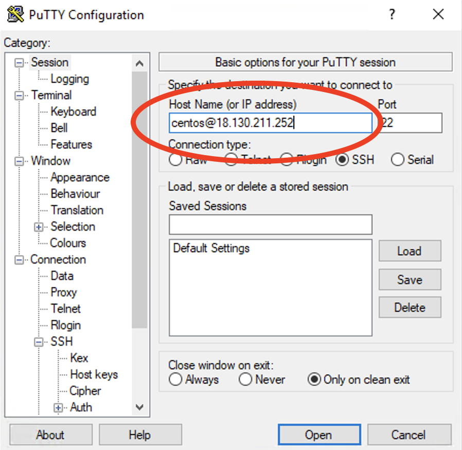
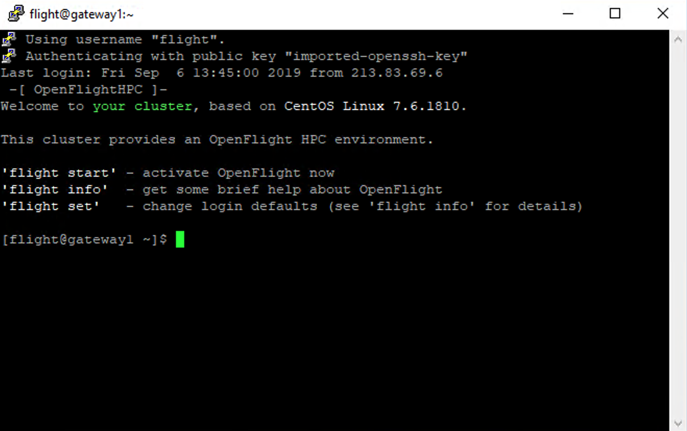

.. _basic_research_environment_operation:

Basic Research Environment Operation
====================================

Logging in
----------

You can access the login node for your private Flight Compute research environment using SSH to connect to the externally facing IP address of the login node. You will need to use the SSH keypair configured for the research environment in order to access it. 

When you login to the research environment via SSH, you are automatically placed in your home-directory. This area is shared across all compute nodes in the research environment, and is mounted in the same place on every compute. Data copied to the research environment or created in your home-directory on the login node is also accessible from all compute nodes. 

Linux/Mac
^^^^^^^^^

To access the research environment login node from a Linux or Mac client, use the following command:

 - ``ssh -i mypublickey.pem flight@52.50.141.144``

 Where:
  - ``mypublickey.pem`` is the name of your private key associated with the public SSH key you set when launching the research environment
  - ``flight`` is the username of the user on the research environment
  - ``52.50.141.144`` is the Access-IP address for the gateway node of the research environment

.. _windows-putty-access:

Windows
^^^^^^^

If you are accessing from a Windows client using the Putty utility, the private key associated with the account will need to be converted to ppk format from pem to be compatible with Putty. This can be done as follows:

- Open PuTTYgen (this will already be installed on your system if Putty was installed using .msi and not launched from the .exe - if you do not think you have this, download putty-installer from here http://www.chiark.greenend.org.uk/~sgtatham/putty/latest.html)
- Select `Conversions -> Import Key`
- Locate `.pem` file and click `open`
- Click `Save Private Key`
- Answer `Yes` to saving without a passphrase
- Input the name for the newly generated ppk to be saved as

To load the key in Putty, select `Connection -> SSH -> Auth`, click `Browse` and select the ppk that was generated from the above steps.

Next, enter the username and IP address of the research environment login node in the "Host Name" box provided (in the `Session` section):

The first time you connect to your research environment, you will be prompted to accept a new server SSH hostkey. This happens because you've never logged in to your research environment before - it should only happen the first time you login; click **OK** to accept the warning. Once connected to the research environment, you should be logged in to the research environment login node as your user.

Becoming the root user
----------------------

Most research environment operations, including starting applications and running jobs, should be performed as the user created when the Flight Compute research environment was launched from the launch template. However - for some privileged operations, users may need to change to being the root user. Users can prefix any command they want to run as the root user with the ``sudo`` command; e.g. 

   ``sudo yum install screen``
   
For security reasons, SSH login as the root user is not permitted to a Flight Compute environment. To get a Linux shell with root privileges, please login as your standard user then execute the command ``sudo -s``. 

.. warning:: Users must exercise caution when running commands as root, as they have the potential to disrupt research environment operations. 

Moving between login and compute nodes
--------------------------------------

openFlight Compute research environments automatically configure a trust relationship between login and compute nodes in the same research environment to allow users to login between nodes via SSH without a password. This configuration allows moving quickly and easily between nodes, and simplifies running large-scale jobs that involve multiple nodes. From the command line, a user can simply use the ``ssh <node-name>`` command to login to one of the compute nodes from the login node. For example, to login to a compute node named ``node01`` from the login node, use the command:

  ``ssh node01``
  
Use the ``logout`` command (or press **CTRL+D**) to exit the compute node and return to the login node.

