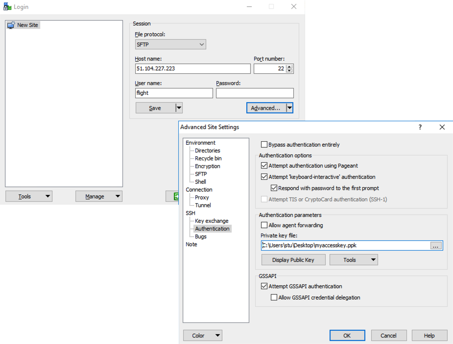
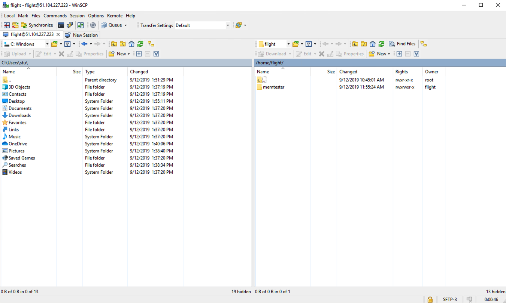

.. _data_basics:

Working with Data and Files
###########################

Organising Data on Your Research Environment
============================================

Shared filesystem
----------------- 

Your openFlight Compute research environment includes a shared home filesystem which is mounted across the login and all compute nodes. Files copied to this area are available via the same absolute path on all research environment nodes. The shared filesystem is typically used for job-scripts, input and output data for the jobs you run.

.. note:: If running a single node research environment then the home directory is not shared over NFS as there are no other resources to share data with

Your home directory
-------------------

The shared filesystem includes the home-directory area for the ``flight`` user which is created when your research environment is launched. Linux automatically places users in their home-directory when they login to a node. By default, Flight Compute will create your home-directory under the ``/users/`` directory, named ``flight`` (``/users/flight``). 

The Linux command line will accept the ``~`` (*tilde*) symbol as a substitute for the currently logged-in users' home-directory. The environment variable ``$HOME`` is also set to this value by default. Hence, the following three commands are all equivalent when logged in as the user **flight**:

 - ``ls /users/flight``
 - ``ls ~``
 - ``ls $HOME``
 

The **root** user in Linux has special meaning as a privileged user, and does not have a shared home-directory across the research environment. The **root** account on all nodes has a home-directory in ``/root``, which is separate for every node. For security reasons, users are not permitted to login to a node as the root user directly - please login as a standard user and use the ``sudo`` command to get privileged access. 

 
Local scratch storage
--------------------- 

Your compute nodes have an amount of disk space available to store temporary data under the ``/tmp`` mount-point. This area is intended for temporary data created during compute jobs, and shouldn't be used for long-term data storage. Compute nodes are configured to clear up temporary space automatically, removing orphan data left behind by jobs. 

Users must make sure that they copy data they want to keep back to the shared filesystem after compute jobs have been completed. 

Copying data between nodes
--------------------------

.. note:: This isn't applicable to a single node research environment

Flight Compute research environment login and compute nodes all mount the shared filesystem, so it is not normally necessary to copy data directly between nodes in the research environment. Users simply need to place the data to be shared in their home-directory on the login node, and it will be available on all compute nodes in the same location. 

If necessary, users can use the ``scp`` command to copy files from the compute nodes to the login node; for example:

 - ``scp node01:/tmp/myfile.txt .``
 
Alternatively, users could login to the compute node (e.g. ``ssh node01``) and copy the data back to the shared filesystem on the node:

.. code:: bash
    
    ssh node01 
    cp /tmp/myfile ~/myfile

Copying data files to the research environment
==============================================

Many compute workloads involve processing data on the research environment - users often need to copy data files to the research environment for processing, and retrieve processed data and results afterwards. This documentation describes a number of methods of working with data on your research environment, depending on how users prefer to transfer it.

Using command-line tools to copy data
-------------------------------------

The research environment login node is accessible via SSH, allowing use of the ``scp`` and ``sftp`` commands to transfer data from your local client machine.

**Linux/Mac**

Linux and Mac users can use in-built SSH support to copy files. To copy file **mydata.zip** to your research environment on IP address 52.48.62.34, use the command:

  ``scp -i mykeyfile.pem mydata.zip flight@52.48.62.34:.``
    
- replace ``mykeyfile.pem`` with the name of your SSH public key
- replace ``flight`` with your username on the research environment

**Windows**

Windows users can download and install the `pscp <http://www.chiark.greenend.org.uk/~sgtatham/putty/download.html>`_ command to perform the same operation (for this you will need your .pem key in .ppk format, see :ref:`connecting from Windows with Putty <windows-putty-access>`):

  ``pscp -i mykeyfile.ppk mydata.zip flight@52.48.62.34:/users/flight/.``
    
**SCP/PSCP**

Both the ``scp`` and the ``pscp`` commands take the parameter ``-r`` to recursively copy entire directories of files to the research environment. 

To retrieve files from the research environment, simply specify the location of the remote file first in the ``scp`` command, followed by the location on the local system to put the file; e.g.

To copy file **myresults.zip** from your research environment on IP address 52.48.62.34 to your local Linux or Mac client:

  ``scp -i mykeyfile.pem flight@52.48.62.34:/users/flight/myresults.zip .``

Using a graphical client to copy data
-------------------------------------

There are also a number of graphical file-management interfaces available that support the SSH/SCP/SFTP protocols. A graphical interface can make it easier for new users to manage their data, as they provide a simple drag-and-drop interface that helps to visualise where data is being stored. The example below shows how to configure the `WinSCP <https://winscp.net/eng/download.php>`_ utility on a Windows client to allow data to be moved to and from a research environment.

- On a Windows client, download and install `WinSCP <https://winscp.net/eng/download.php>`_
- Start WinSCP; in the **login** configuration box, enter the IP address of your Flight Compute research environment login node in the ``Host name`` box
- Enter the username you configured for your research environment in the ``User name`` box (the default user is ``flight``)
- Click on the ``Advanced`` box and navigate to the ``SSH`` sub-menu, and the ``Authentication`` item
- In the ``Private key file`` box, select your research environment access private key, and click the ``OK`` box.

- Optionally click the ``Save`` button and give this session a name
- Click the ``Login`` button to connect to your research environment
- Accept the warning about adding a new server key to your cache; this message is displayed only once when you first connect to a new research environment
- WinSCP will login to your research environment; the window shows your local client machine on the left, and the research environment on the right
- To copy files to the research environment from your client, click and drag them from the left-hand window and drop them on the right-hand window
- To copy files from the research environment to your client, click and drag them from the right-hand window and drop them on the left-hand window

The amount of time taken to copy data to and from your research environment will depend on a number of factors, including:

 - The size of the data being copied
 - The speed of your Internet link to the research environment; if you are copying large amounts of data, try to connect using a wired connection rather than wireless
 - The type and location of your research environment login node instance
 

Object storage for archiving data
---------------------------------

As an alternative to copying data back to your client machine, users may prefer to upload their data to a cloud-based object storage service instead. Cloud storage solutions such as `AWS S3 <https://aws.amazon.com/s3/>`_, `Dropbox <https://www.dropbox.com/>`_ and `SWIFT <https://wiki.openstack.org/wiki/Swift>`_ have command-line tools which can be used to connect existing cloud storage to your research environment. Benefits of using an object-based storage service include:

 - Data is kept safe and does not have to be independently backed-up
 - Storage is easily scalable, with the ability for data to grow to practically any size
 - You only pay for what you use; you do not need to buy expansion room in advance
 - Storage service providers often have multiple tiers available, helping to reduce the cost of storing data
 - Data storage and retrieval times may be improved, as storage service providers typically have more bandwidth than individual sites
 - Your company, institution or facility may receive some storage capacity for free which you could use
 
Object storage is particularly useful for archiving data, as it typically provides a convenient, accessible method of storing data which may need to be shared with a wide group of individuals. 

Saving data before terminating your research environment
--------------------------------------------------------

When you've finished working with your OpenFlight Flight Compute research environment, you can select to terminate it in the console for your Cloud service. This will stop any running instances and wipe the shared storage area before returning the block storage volumes back to the provider. Before you shutdown your research environment, users must ensure that they store their data safely in a persistent service, using one of the methods described in this documentation. When you next launch a Flight Compute research environment, you can restore your data from the storage service to begin processing again. 

