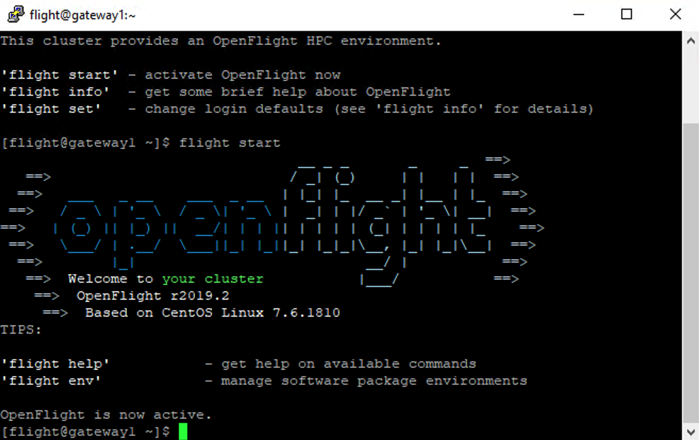

.. _flight-environment:

Flight Environment
==================

.. _activate-flight-env:

Activating the Flight Environment
---------------------------------

Flight Compute comes with a powerful software management environment that can (optionally) be used to streamline application installations for the research environment.

This provides some quick tips to activating the environment and finding out more about the flight environment (``flight info``).

To load the environment, simply run ``flight start`` (which, when first run, will generate some login keys for allowing passwordless login to compute nodes)

.. tip:: The flight environment can be set to automatically start on login for the user by running ``flight set always on``

Working with Package Environments
---------------------------------

Various :ref:`package-environments` are available for managing software on your Flight research environment. These can be installed using the ``env`` subcommand::

    [flight@gateway1 (scooby) ~]$ flight env create gridware

Once a package environment has been installed, it needs to be activated for the session to be able to manage software with it::

    [flight@gateway1 (scooby) ~]$ flight env activate gridware
    <gridware> [flight@gateway1 (scooby) ~]$

.. tip:: Your preferred software environment can be set to automatically activate for your user within the flight environment by running ``flight env set-default gridware``, replacing gridware with your chosen software environment

