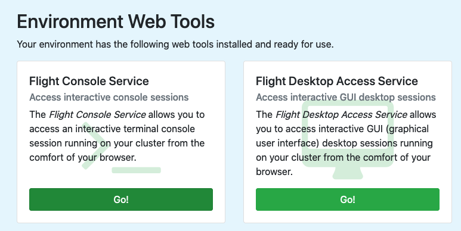
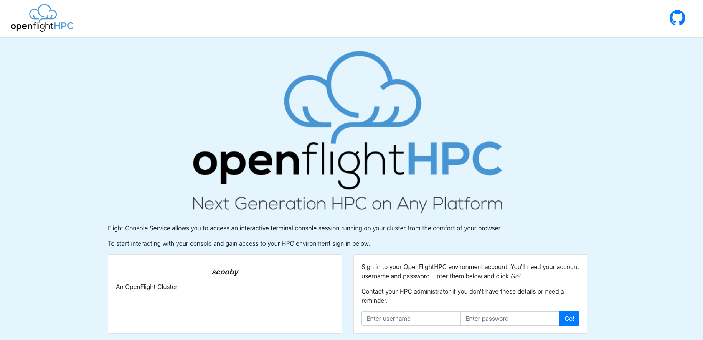
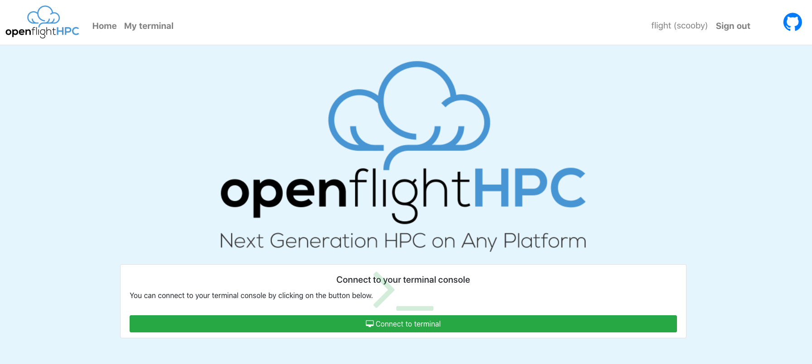
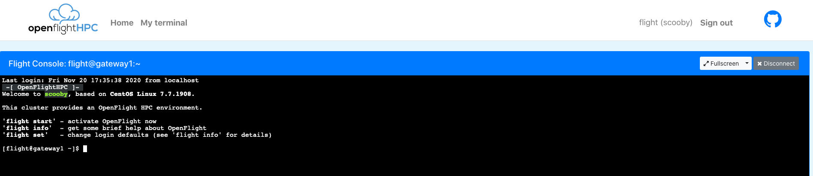

.. _flight-console:

Flight Console
==============

A landing page is presented when navigating to the external IP or hostname for the gateway. This page will show the available web suite tools and allow for launching of the chosen tool.

Logging In
----------

After selecting the console service, a page with the cluster name, description and a login box will be presented. The same user details used for accessing the cluster from a CLI are used to authenticate the session.

On successful login, the terminal application will be ready to connect to the cluster.

Connecting to the Terminal
--------------------------

To launch a web terminal for the cluster, simply click the Connect button.

A terminal will be launched and connected.

There are a few options for the terminal view, such as, making it Full Screen, changing to Zen Mode (terminal focussed with less widgets and buttons polluting the screen) and disconnecting the terminal session.

