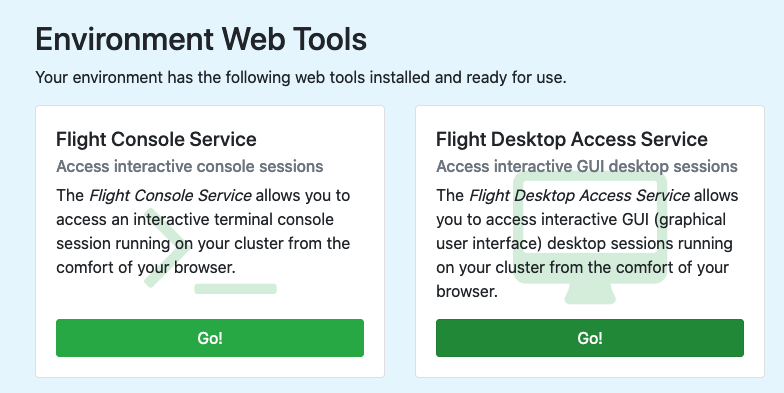
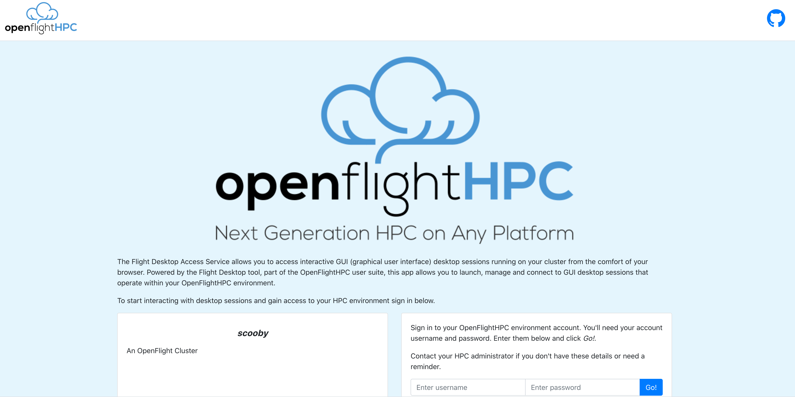
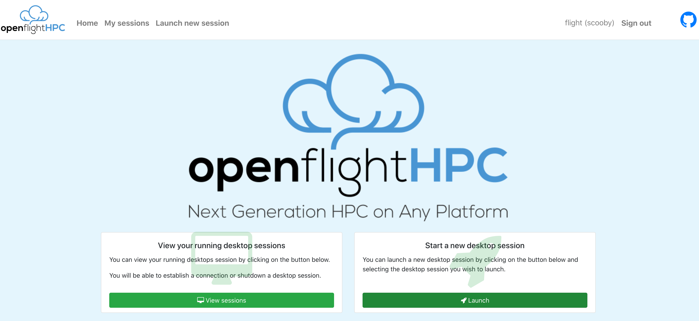
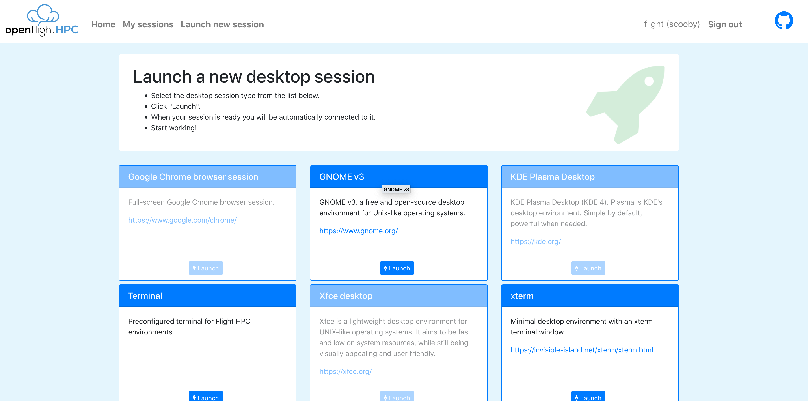
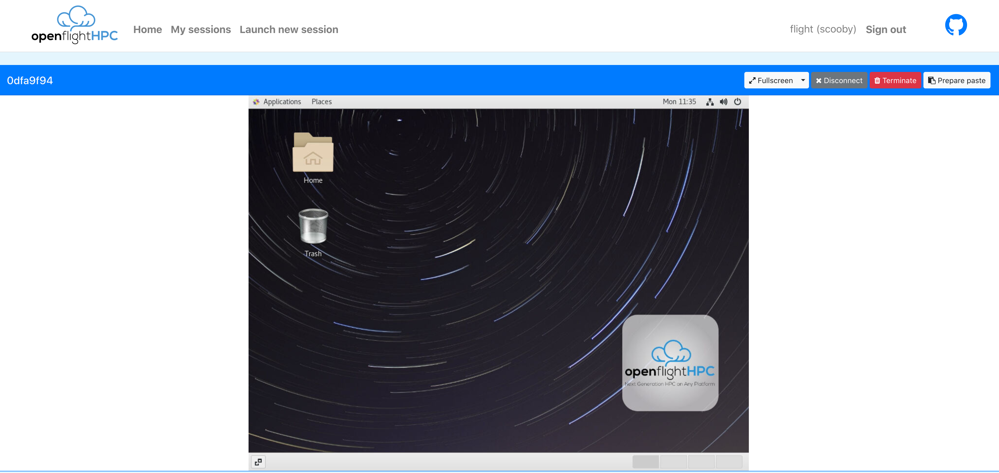
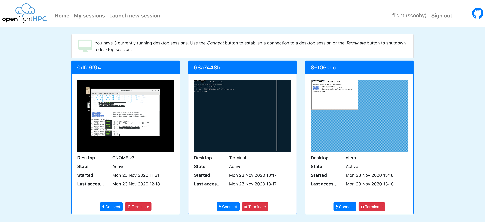

.. _flight-desktop-web:

Flight Desktop
==============

A landing page is presented when navigating to the external IP or hostname for the gateway. This page will show the available web suite tools and allow for launching of the chosen tool.

Logging In
----------

After selecting the desktop service, a page with the cluster name, description and a login box will be presented. The same user details used for accessing the cluster from a CLI are used to authenticate the session.

On successful login, the desktop manager will be ready to be used.

Creating Desktop Session
------------------------

To launch a desktop session for the cluster, select "Launch" from the management page then select the desired desktop environment to launch 

The system will begin to setup the vnc session before automatically connecting to the desktop session.

There are a few options for the desktop view, such as, making it Full Screen, changing to Zen Mode (terminal focussed with less widgets and buttons polluting the screen), disconnecting from the desktop session and terminating the session completely.

A Note on Pasting
^^^^^^^^^^^^^^^^^

The desktop web suite does allow for remote & local clipboard integration. If text is copied on the remote session then it will be immediately available on the local clipboard.

For copying local data to the remote session a little bit of a workaround is needed:
- Copy text
- Click "Prepare Paste" in the desktop webapp
- Paste text in the remote session

Managing Desktop Sessions
-------------------------

Selecting the "My Sessions" link in the header will present all existing desktop sessions for the user, from here sessions can be connected to or terminated through the corresponding buttons. Additionally, this session manager will generate previews of the various desktop sessions to make it easier to identify the different active sessions.

